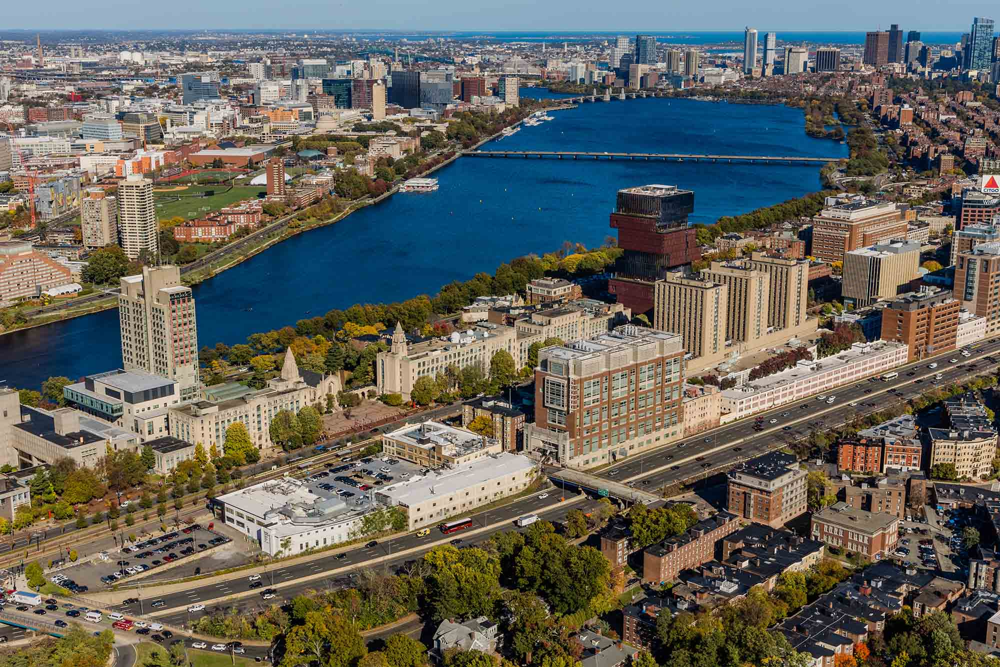

p {
  margin: 0;      /* Removes the default margin from paragraphs */
  padding: 0;     /* Removes the default padding from paragraphs */
  line-height: 1; /* Sets line height to 1 to ensure single spacing */
}

<b>Office Address</b>

Photonics Center, Room 725

8 St. Mary’s Street 

Boston, MA 02215

Email: wangty-at-bu-dot-edu

Phone: 617-353-3251

<b>Mailing Address</b>

<u>Paper mails</u>: 

Photonics Center, Room 725

8 St. Mary’s Street 

Boston, MA 02215

<u>Packages</u>: 

Room 103B

22 Babbitt Street
 

Boston, MA 02215

(A door code applies to this room. Please contact me in advance for it.)

External links:

<a href="https://www.bu.edu/eng/profile/tianyu-wang-phd/">BU ECE Page</a>

<a href="https://www.bu.edu/neurophotonics/people/faculty/">BU Biophotonics Center Page</a>

<b>Interactive Map</b>

Walking distance zones: ■ 15 min;  ■ 30 min; ■ 45 min.

<iframe src="https://www.google.com/maps/d/embed?mid=1lg_S5-g6jTJ7n9BzltlJUgfOPZROPiU&ehbc=2E312F" width="960" height="600"></iframe>

ECE department and Photonics Center (the high-rise building slightly to the right of the center of the photo)  
and BU Charles River campus (also with <a href="https://www.bu.edu/alumni/news/web-cams/">live camera</a>)

<a href="/misc_maps/">More views of Boston and featured maps</a>
