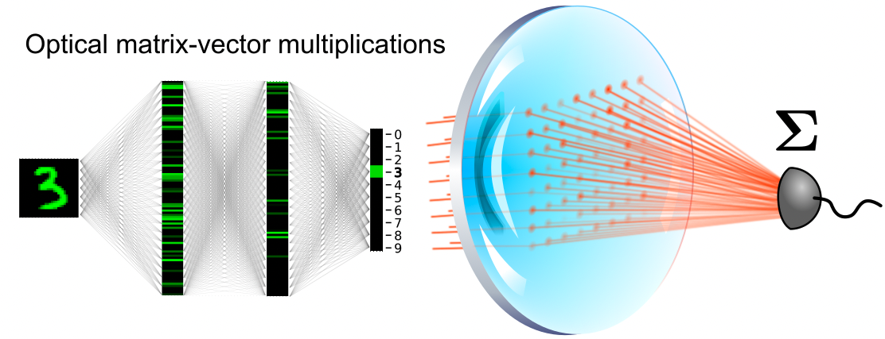
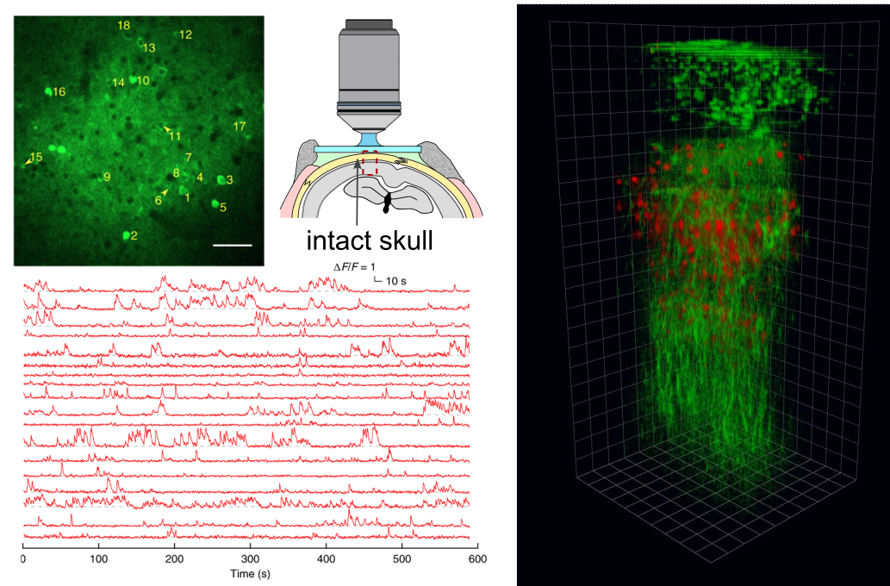

<h1 style="margin-left: -50px;">Publications</h1>



<a href="https://scholar.google.com/citations?user=lqIvJCgAAAAJ&hl=e" class="btn" style="margin-left: -50px;">Google scholar</a>

<section id="main" >
	

		<h2 style="margin-left: -50px;">2023</h2>
		    

				

					

						
					

					

						J. Laydevant, L.G. Wright, T. Wang, P.L. McMahon 
						The hardware is the software 
						<a href="https://doi.org/10.48550/arXiv.2310.18335" style="font-weight:bold;"><i>arXiv:2310.18335</i> (2023)</a>
					

				

			
 
			

				

					

						
					

					

						T. Wang*&dagger;, M.M. Sohoni*&dagger;, L.G. Wright&dagger;, M.M. Stein, S.-Y. Ma, T. Onodera, M. Anderson, P.L. McMahon&dagger; 
						Image sensing with multilayer, nonlinear optical neural networks 
						<a href="https://doi.org/10.1038/s41566-023-01170-8" style="font-weight:bold;"><i>Nature Photonics</i> <b>17</b>, 408 - 415 (2023)</a> | <a href="https://arxiv.org/abs/2207.14293">arXiv</a> | <a href="https://github.com/mcmahon-lab/Image-sensing-with-multilayer-nonlinear-optical-neural-networks">code repo</a>
					

				

			
 
			

				

					

						
					

					

						S.-Y. Ma, T. Wang, J. Laydevant, L.G. Wright, P.L. McMahon 
						Quantum-noise-limited optical neural networks operating at a few quanta per activation 
						<a href="https://arxiv.org/abs/2307.15712" style="font-weight:bold;"><i>arXiv:2307.15712</i> (2023)</a>
					

				

			
 
			

				

					

						
					

					

						M.G. Anderson, S.-Y. Ma, T. Wang, L.G. Wright, P.L. McMahon 
						Optical Transformers 
						<a href="https://arxiv.org/abs/2302.10360" style="font-weight:bold;"><i>arXiv:2302.10360</i> (2023)</a>
					

				

			
 
		<h2 style="margin-left: -50px;">2022</h2>
			

				

					

						
					

					

						L.G. Wright*, T. Onodera*, M.M. Stein, T. Wang, D.T. Schachter, Z. Hu, P.L. McMahon 
						Deep physical neural networks trained with backpropagation 
						<a href="https://doi.org/10.1038/s41586-021-04223-6" style="font-weight:bold;"><i>Nature</i> <b>601</b>, 549 - 555 (2022)</a> | <a href="https://arxiv.org/abs/2104.13386">arXiv</a> | <a href="https://github.com/mcmahon-lab/Physics-Aware-Training">code repo</a>
					

				

			
 
			

				

					

						
					

					

						K. Choe, Y. Hotani, T. Wang, E. Hebert, D.G. Ouzounov, K. Lai, A. Singh, W. Béguelin, A.M. Melnick, C. Xu 
						Intravital three-photon microscopy allows visualization over the entire depth of mouse lymph nodes 
						<a href="https://doi.org/10.1038/s41590-021-01101-1" style="font-weight:bold;"><i>Nature Immunology</i> <b>23</b>, 330 - 340 (2022)</a>
					

				

			
 
			

				

					

						
					

					

						T. Wang&dagger;, S.-Y. Ma, L.G. Wright, T. Onodera, B. Richard, P.L. McMahon&dagger; 
						An optical neural network using less than 1 photon per multiplication 
						<a href="https://doi.org/10.1038/s41467-021-27774-8" style="font-weight:bold;"><i>Nature Communications</i> <b>13</b>, 123 (2022)</a> | <a href="https://arxiv.org/abs/2104.13467">arXiv</a> | <a href="https://github.com/mcmahon-lab/ONN-QAT-SQL">code repo</a>
					

				

			
 
		        

				

					

						
					

					

						D. Sinefeld, F. Xia, M. Wang, T. Wang, C. Wu, X. Yang, H.P. Paudel, D.G. Ouzounov, T.G. Bifano, C. Xu 
						Three-photon adaptive optics for mouse brain imaging 
						<a href="https://doi.org/10.3389/fnins.2022.880859" style="font-weight:bold;"><i>Frontiers in Neuroscience</i> <b>16</b>, 880859 (2022)</a> 
					

				

			
 
		<h2 style="margin-left: -50px;">2021</h2>
			

				

					

						
					

					

						The MICrONS Consortium. J.A. Bae, ... C. Zhang 
						Functional connectomics spanning multiple areas of mouse visual cortex 
						<a href="https://doi.org/10.1101/2021.07.28.454025" style="font-weight:bold;"><i>bioRxiv</i>, 2021.07.28.454025 (2021)</a> 
					

				

			
 
		<h2 style="margin-left: -50px;">2020</h2>
			

				

					

						
					

					

						T. Wang, and C. Xu 
						Three-photon neuronal imaging in deep mouse brain 
						<a href="https://doi.org/10.1364/OPTICA.395825" style="font-weight:bold;"><i>Optica</i> <b>7</b>, 947-960 (2020)</a> 
					

				

			
 
			

				

					

						
					

					

						S. Lee, A.J. Cortese, A. Mok, C. Wu, T. Wang, J.U. Park, C.L. Smart, S. Ghajari, D. Khilani, S. Sadeghi, Y. Ji, J.H. Goldberg, C. Xu, P.L. McEuen, and A.C. Molnar 
						Fabrication of Injectable Micro-Scale Opto-Electronically Transduced Electrodes (MOTEs) for Physiological Monitoring 
						<a href="https://doi.org/10.1109/JMEMS.2020.2999496" style="font-weight:bold;"><i>Journal of Microelectromechanical Systems</i> <b>29</b>, 720-726 (2020)</a> 
					

				

			
 
			

				

					

						
					

					

						A.J. Cortese, C.L. Smart, T. Wang, M.F. Reynolds, S.L. Norris, Y. Ji, S. Lee, A. Mok, C. Wu, F. Xia, N.I. Ellis, A.C. Molnar, C. Xu, and P.L. McEuen 
						Microscopic sensors using optical wireless integrated circuits 
						<a href="https://doi.org/10.1073/pnas.1919677117" style="font-weight:bold;"><i>Proceedings of the National Academy of Sciences</i> <b>117</b>, 9173-9179 (2020)</a> 
					

				

			
 
		        

				

					

						
					

					

						T. Wang*&dagger;, C. Wu*, D.G. Ouzounov, W. Gu, F. Xia, M. Kim, X. Yang, M.R. Warden, and C. Xu&dagger; 
						Quantitative analysis of 1300-nm three-photon calcium imaging in the mouse brain 
						<a href="https://doi.org/10.7554/eLife.53205" style="font-weight:bold;"><i>eLife</i> <b>9</b>, e53205 (2020)</a>  | <a href="https://www.biorxiv.org/content/10.1101/846535v1">bioRxiv</a> | <a href="https://github.com/gangsterKitty/3P-Brain-Heating">code repo</a>
					

				

			
 
		<h2 style="margin-left: -50px;">2019</h2>
			

				

					

						
					

					

						D.G. Ouzounov, T. Wang, C. Wu, and C. Xu 
						GCaMP6 ΔF/F dependence on the excitation wavelength in 3-photon and 2-photon microscopy of mouse brain activity 
						<a href="https://doi.org/10.1364/BOE.10.003343" style="font-weight:bold;"><i>Biomedical Optics Express</i> <b>10</b>, 3343-3352 (2019)</a> 
					

				

			
 
		<h2 style="margin-left: -50px;">2018</h2>
			

				

					

						
					

					

						T. Wang&dagger;, D.G. Ouzounov, C. Wu, N.G. Horton, B. Zhang, C.-H. Wu, Y. Zhang, M.J. Schnitzer, and C. Xu&dagger; 
						Three-photon imaging of mouse brain structure and function through the intact skull 
						<a href="https://doi.org/10.1038/s41592-018-0115-y" style="font-weight:bold;"><i>Nature Methods</i> <b>15</b>,  789–792 (2018)</a> 
					

				

			
 
		<h2 style="margin-left: -50px;">2017</h2>
			

				

					

						
					

					

						D.G. Ouzounov*, T. Wang*, M. Wang, D.D. Feng, N.G. Horton, J.C. Cruz-Hernández, Y.-T. Cheng, J. Reimer, A.S. Tolias, N. Nishimura, and C. Xu 
						In vivo three-photon imaging of activity of GCaMP6-labeled neurons deep in intact mouse brain 
						<a href="https://doi.org/10.1038/nmeth.4183" style="font-weight:bold;"><i>Nature Methods</i> <b>14</b>,  388–390 (2017)</a> 
					

				

			
 
			

				

					

						
					

					

						G. Rasskazov, A. Ryabtsev, K. Charan, T. Wang, C. Xu, and M. Dantus 
						Characterization and adaptive compression of a multi-soliton laser source 
						<a href="https://doi.org/10.1364/OE.25.000320" style="font-weight:bold;"><i>Optics Express</i> <b>25</b>,  320–329 (2017)</a> 
					

				

			
 
		<h2 style="margin-left: -50px;">2016</h2>
			

				

					

						
					

					

						Y. Tang, L.G. Wright, K. Charan, T. Wang, C. Xu, and F.W. Wise 
						Generation of intense 100 fs solitons tunable from 2 to 4.3 μm in fluoride fiber 
						<a href="https://doi.org/10.1364/OPTICA.3.000948" style="font-weight:bold;"><i>Optica</i> <b>3</b>,  948–951 (2016)</a> 
					

				

			
 
	

	* denotes equal contribution; &dagger; denotes corresponding author.
</section>

