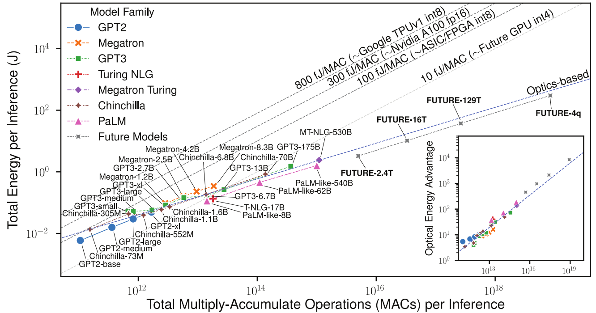


  You can also find my articles on <u><a href="{{author.googlescholar}}">my Google Scholar profile</a>.</u>




<section id="main" >
	

		<h2>2023</h2>
			

				

					

						
					

					

						T. Wang*, M.M. Sohoni*, L.G. Wright, M.M. Stein, S.-Y. Ma, T. Onodera, M. Anderson, P.L. McMahon 
						Image sensing with multilayer, nonlinear optical neural networks 
						<a href="https://doi.org/10.1038/s41566-023-01170-8" style="font-weight:bold;"><i>Nature Photonics</i> <b>17</b>, 408 - 415 (2023)</a> | <a href="https://arxiv.org/abs/2207.14293">arXiv</a> | <a href="https://github.com/mcmahon-lab/Image-sensing-with-multilayer-nonlinear-optical-neural-networks">code repo</a>
					

				

			
 
			

				

					

						
					

					

						S.-Y. Ma, T. Wang, J. Laydevant, L.G. Wright, P.L. McMahon 
						Quantum-noise-limited optical neural networks operating at a few quanta per activation 
						<a href="https://arxiv.org/abs/2307.15712" style="font-weight:bold;"><i>arXiv:2307.15712</i> (2023)</a>
					

				

			
 
			

				

					

						
					

					

						M.G. Anderson, S.-Y. Ma, T. Wang, L.G. Wright, P.L. McMahon 
						Optical Transformers 
						<a href="https://arxiv.org/abs/2302.10360" style="font-weight:bold;"><i>arXiv:2302.10360</i> (2023)</a>
					

				

			
 
		<h2>2022</h2>
			

				

					

						
					

					

						L.G. Wright*, T. Onodera*, M.M. Stein, T. Wang, D.T. Schachter, Z. Hu, P.L. McMahon 
						Deep physical neural networks trained with backpropagation 
						<a href="https://doi.org/10.1038/s41586-021-04223-6" style="font-weight:bold;"><i>Nature</i> <b>601</b>, 549 - 555 (2022)</a> | <a href="https://arxiv.org/abs/2104.13386">arXiv</a> | <a href="https://github.com/mcmahon-lab/Physics-Aware-Training">code repo</a>
					

				

			
 
			

				

					

						
					

					

						K. Choe, Y. Hotani, T. Wang, E. Hebert, D.G. Ouzounov, K. Lai, A. Singh, W. Béguelin, A.M. Melnick, C. Xu 
						Intravital three-photon microscopy allows visualization over the entire depth of mouse lymph nodes 
						<a href="https://doi.org/10.1038/s41590-021-01101-1" style="font-weight:bold;"><i>Nature Immunology</i> <b>23</b>, 330 - 340 (2022)</a>
					

				

			
 
			

				

					

						
					

					

						T. Wang, S.-Y. Ma, L.G. Wright, T. Onodera, B. Richard, P.L. McMahon 
						An optical neural network using less than 1 photon per multiplication 
						<a href="https://doi.org/10.1038/s41467-021-27774-8" style="font-weight:bold;"><i>Nature Communications</i> <b>13</b>, 123 (2022)</a> | <a href="https://arxiv.org/abs/2104.13467">arXiv</a> | <a href="https://github.com/mcmahon-lab/ONN-QAT-SQL">code repo</a>
					

				

			
 
		        

				

					

						
					

					

						D. Sinefeld, F. Xia, M. Wang, T. Wang, C. Wu, X. Yang, H.P. Paudel, D.G. Ouzounov, T.G. Bifano, C. Xu 
						Three-Photon Adaptive Optics for Mouse Brain Imaging 
						<a href="https://doi.org/10.3389/fnins.2022.880859" style="font-weight:bold;"><i>Frontiers in Neuroscience</i> <b>16</b>, 880859 (2022)</a> 
					

				

			
 
		<h2>2021</h2>
			

				

					

						
					

					

						The MICrONS Consortium. J.A. Bae, ... C. Zhang 
						Functional connectomics spanning multiple areas of mouse visual cortex 
						<a href="https://doi.org/10.1101/2021.07.28.454025" style="font-weight:bold;"><i>bioRxiv</i>, 2021.07.28.454025 (2021)</a> 
					

				

			
 
		<h2>2020</h2>
		<h2>2019</h2>
		<h2>2018</h2>
		<h2>2017</h2>
	

</section>

