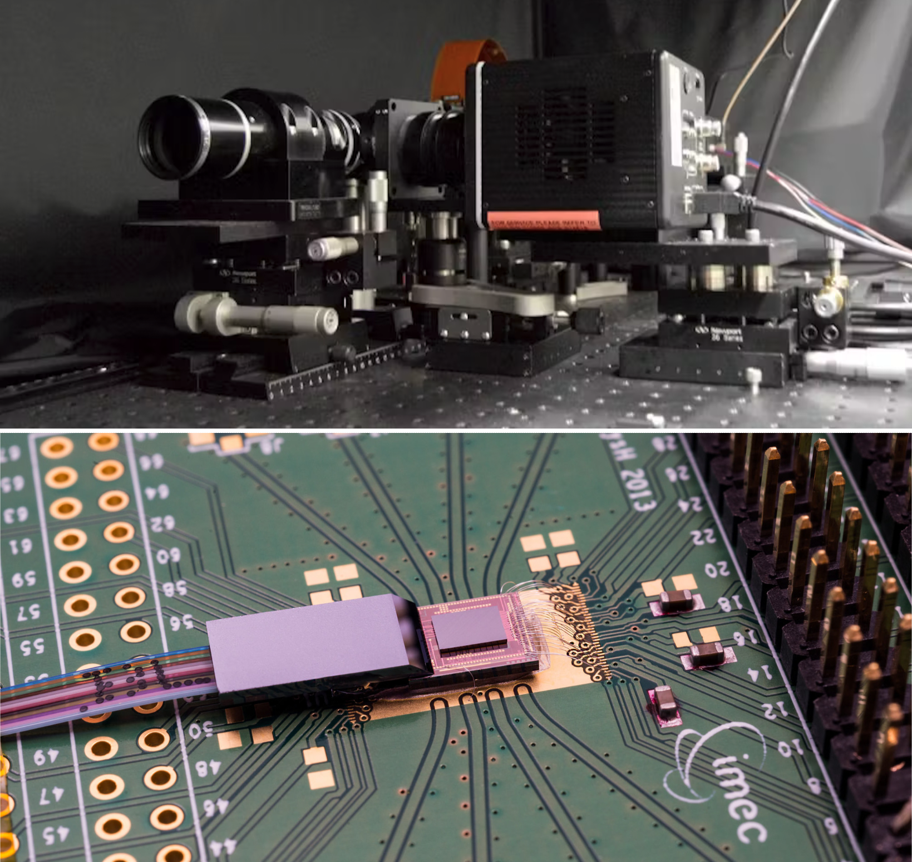
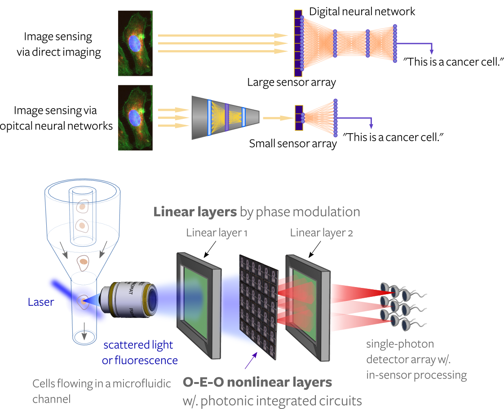
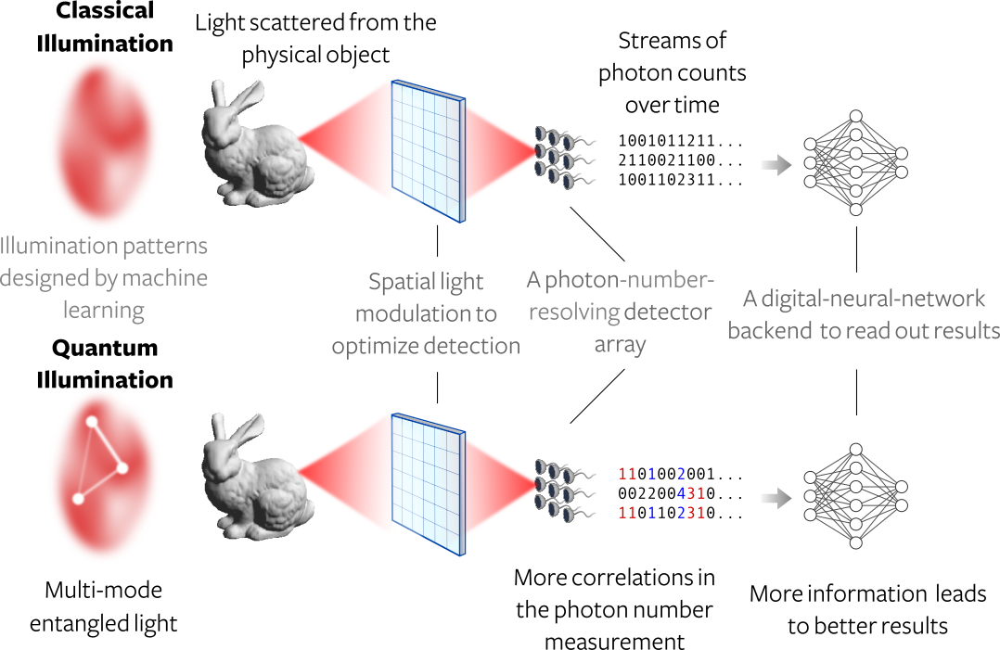
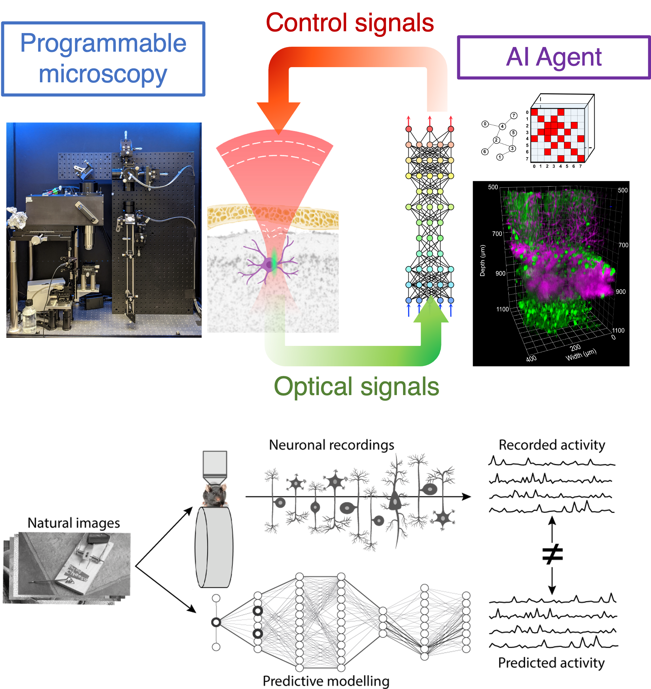
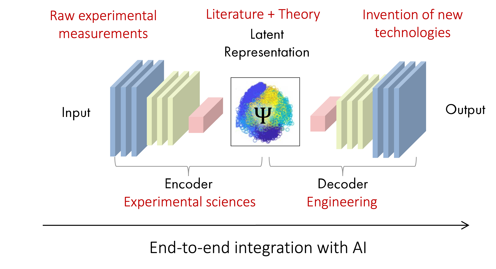

<h1 style="margin-left: -50px;">Research Topics</h1>

<h2 style="font-size:18pt;line-height:1.5;margin-left: -50px;"> Neuromorphic Computing with Light </h2>

    

        

            Recent advances in artificial intelligence (AI) has resulted in a resurgence of interest in developing photonic neural networks for efficient machine-learning computation. AI and photonic computing form a nice synergy since neural-network models, especially large ones, bring the best out of optical processors by stressing their strengths in data transmission and reuse. Based on these physical properties, photonic neural networks represent a class of analog computing systems that have been experimentally shown to approach the physical limit of computation, using even single photons for each operation. Our interest in photonic neural networks is twofold:
            <ol> 
                <li> <u>Hardware</u>: We are interested in exploring a hardware platform that enables photonic neural networks to be both scalable and compact. </li>
                <li> <u>Software</u>: We are interested in using photonic neural networks as a testbed to study novel computing phenomena in the analog noisy regime. </li>
            </ol>
        

        

            
            
 
                Top: a free-space photonic-neural-network apparatus for large-scale matrix-vector mulitplication (&#x7e;700&#215;700 in matrix size) 
                Bottom: a generic photonic chip as an integrated platform for optical information processing; image from imec.
            

        

    

    Further reading:
    <ul>
        <li>P.L. McMahon. <a href="https://doi.org/10.1038/s42254-023-00645-5">The physics of optical computing.</a> <i>Nature Review Physics</i> (2023).</li>
        <li><u>T. Wang</u>, <i>et al.</i> <a href="https://doi.org/10.1038/s41467-021-27774-8">An optical neural network using less than 1 photon per multiplication.</a> <i>Nature Communications</i> <b>13</b>, 123 (2022).</li>
        <li>S. Lloyd. <a href="https://doi.org/10.1038/35023282">Ultimate physical limits to computation.</a> <i>Nature</i> <b>406</b>, 1047–1054 (2000) | Wikipedia <a href="https://en.wikipedia.org/wiki/Limits_of_computation#:~:text=Seth%20Lloyd%20calculated%20the%20computational,it%20could%20compute%20at%20a">Limits of Computation</a></li>
    </ul>

 

<h2 style="font-size:18pt;line-height:1.5;margin-left: -50px;"> Computational Sensors based on Neuromorphism </h2>

    

        

            Another opportunity offered by photonic neuromorphic computing is its potential to make smarter and more efficient sensors. Unlike computational imaging, whose goal is to produce full-resolution images through computational reconstruction, the primary goal of image sensing is to capture only salient features at a precision and speed not possible with traditional hardware. This performance is achieved by taking a holistic approach towards system design: By breaking down the walls between imaging, sensing, and computing modules in a conventional system and strategically offloading some computation to optics and sensors, we can train the entire system in an end-to-end fashion for a specific machine-vision task.  
            &nbsp;&nbsp;&nbsp;&nbsp;&nbsp;&nbsp;In general, obtaining results without recording all intermediate data is a neuromorphic design principle, commonly adopted by biological organisms and autonomous systems to perform tasks in real time. We are interested in demonstrating the impact of this computational sensing scheme by using it to solve real-world problems in high-speed robotics and high-throughput biomedical assays.
        

        

            
            
 
                Top: The principle of image sensing as compared to traditional computer vision.  
                Bottom: An envisioned application of ultra-fast image sensing for high-throughput biomedical assays.
            

        

    

    Further reading:
    <ul>
        <li>G. Wetzstein, A. Ozcan, S. Gigan, <i>et al.</i> <a href="https://doi.org/10.1038/s41586-020-2973-6"> Inference in artificial intelligence with deep optics and photonics.</a> <i>Nature</i> <b>588</b>, 39–47 (2020).</li>
        <li>P. Sterling and S. Laughlin. <i>Principles of Neural Design</i> (MIT Press, 2015).</li>
        <li><u>T. Wang*</u>, M.M. Sohoni*, L.G. Wright, <i>et al.</i> <a href="https://doi.org/10.1038/s41586-020-2973-6"> Image sensing with multilayer, nonlinear optical neural networks.</a> <i>Nature Photonics</i> <b>17</b>, 408 - 415 (2023).</li>
    </ul>

 

<h2 style="font-size:18pt;line-height:1.5;margin-left: -50px;"> Imaging and Sensing with Quantum Light </h2>

    

        

            Quantum and other exotic states of light are enticing for imaging and sensing applications. This is because quantum resources, such as entanglement, allow us to engineer the collective behavior of multiple photons, enabling each photon to carry more information than its classical counterpart. This extra information translates to various forms of quantum sensing/imaging advantages, such as enhanced phase measurement precision, image resolution, or multiphoton excitation. However, many questions still remain:  
            &nbsp;&nbsp;&nbsp;&nbsp;&nbsp;&nbsp;Can we engineer a state of light that can lead to scalable quantum sensing advantages, in presence of loss and background noise? How can we utilize quantum resources for an advantage in machine-learning tasks? In the context of optical imaging and sensing, we are interested in developing systems and computational methods to demonstrate practical quantum sensing advantages for real-world applications.
        

        

            
        

    

    Further reading:
    <ul>
        <li>P.-A. Moreau, <i>et al.</i> <a href="https://doi.org/10.1038/s42254-019-0056-0"> Imaging with quantum states of light.</a> <i>Nature Review Physics</i> <b>1</b>, 367–380 (2019).</li>
        <li>S. Pirandola, <i>et al.</i> <a href="https://doi.org/10.1038/s41566-018-0301-6"> Advances in photonic quantum sensing.</a> <i>Nature Photonics</i> <b>12</b>, 724–733 (2018).</li>
    </ul>

 

<h2 style="font-size:18pt;line-height:1.5;margin-left: -50px;"> Understanding Biological Neural Computation with Light </h2>

    

        

            Despite the breakthroughs in AI, the working principle of its source of inspiration &mdash; biological neural networks &mdash; is still not fully understood. The difficulty is twofolded, it is both challenging to measure and to analyze neural activity data. We are interested in helping with this endeavor in two ways:
            <ol> 
                <li> <u>Seeing through scattered light</u>: While optical imaging provides a minimally invasive way to record the activities of biological neurons across a large population, imaging through turbid biological tissue is challenging due to the highly complex and dynamic nature of tissue-induced light scattering. We are interested in exploring new approaches using a mixture of physics and AI methods for fast light de-scattering. When combined with state-of-the-art optical microscopy or spectroscopy, these methods will enable us to substantially push the depth of brain imaging. </li>
                <li> <u>Modeling neuronal activity data</u>: To test whether current large-scale neuronal recording datasets contain the information necessary for decoding brain functions, we propose using state-of-the-art AI models for neuronal data analysis, with a focus on model's predictive power.</li>
            </ol>
        

        

            
            
 
                Top: The concept of smart miscroscopy that tailors to sample condition instantly in an autonomous fashion.  
                Bottom: The open question of predicting neuronal activites based on sensory inputs and behavior outputs; image from https://doi.org/10.48550/arXiv.2305.19654.
            

        

    

    Further reading:
    <ul>
        <li>A.E. Carpenter, B.A. Cimini, K.W. Eliceiri. <a href="https://doi.org/10.1038/s41592-023-01912-0"> Smart microscopes of the future.</a> <i>Nature Methods</i> <b>20</b>, 962–964 (2023).</li>
        <li>B.A. Richards, T.P. Lillicrap, P.Beaudoin, <i>et al.</i> <a href="https://doi.org/10.1038/s41593-019-0520-2"> A deep learning framework for neuroscience.</a> <i>Nature Neuroscience</i> <b>22</b>, 1761–1770 (2019).</li>
        <li>S. Gigan, O. Katz, H.B. de Aguiar, <i>et al.</i> <a href="https://doi.org/10.1088/2515-7647/ac76f9"> Roadmap on wavefront shaping and deep imaging in complex media.</a> <i>J. Phys. Photonics</i> <b>4</b>, 042501 (2022).</li>
        <li><u>T. Wang</u>, and C. Xu <a href="https://doi.org/10.1364/OPTICA.395825"> Three-photon neuronal imaging in deep mouse brain.</a> <i>Optica</i> <b>7</b>, 947-960 (2020).</li>
        <li><u>T. Wang</u>, ... and C. Xu <a href="https://doi.org/10.1038/s41592-018-0115-y"> Three-photon imaging of mouse brain structure and function through the intact skull.</a> <i>Nature Methods</i> <b>15</b>, 789-792 (2018).</li>
        <li>D.G. Ouzounov*, <u>T. Wang*</u>, ... and C. Xu <a href="https://doi.org/10.1038/nmeth.4183"> In vivo three-photon imaging of activity of GCaMP6-labeled neurons deep in intact mouse brain. </a> <i>Nature Methods</i> <b>14</b>, 388-390 (2017).</li>
    </ul>

 

<h2 style="font-size:18pt;line-height:1.5;margin-left: -50px;"> Artificial Intelligence for Physical Sciences </h2>

    

        

            Recent advances in AI, including reinforcement learning, multimodal, few-shot learning, and large language models, will generate long-lasting impacts on how we conduct scientific research, from how experiments are desinged and performed to how the results are analyzed and circulated. In this regard, we are keen on exploring ways state-of-the-art AI models and tools can be used to accelerate scientific research and rethinking the roles human researchers play in science. 
        

        

            
        

    

    Further reading:
    <ul>
        <li>H. Wang, T. Fu, Y. Du, <i>et al.</i> <a href="https://doi.org/10.1038/s41586-023-06221-2">Scientific discovery in the age of artificial intelligence.</a> <i>Nature</i> <b>620</b>, 47–60 (2023).</li>
        <li>L.G. Wright*, T. Onodera*, M.M. Stein, <u>T. Wang</u> <i>et al.</i> <a href="https://doi.org/10.1038/s41586-021-04223-6">Deep physical neural networks trained with backpropagation.</a> <i>Nature</i> <b>601</b>, 549-555 (2022).</li>
    </ul>

 

