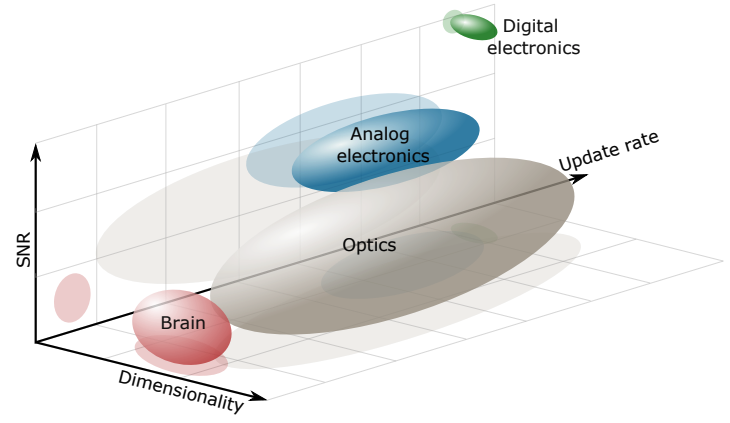

## Neuromorphic Computing with Light ##

    

        

            The recent advancement in modern artificial intelligence (AI) has led to a resurgence of interest in developing photonic neural neteworks for more efficient machine-learning computation. AI and photonic computing form a nice synergy since neural-network models, especially large models, bring the best out of the optical processors by fully leveraging the physical properties of light to facilitate efficient data transmission and reuse. While the benefits is warranted by physics, it is still an open challenge to identify the most promising hardware platform to provide sufficient scaling while keeping the system compact.  
            &nbsp;&nbsp;&nbsp;&nbsp;&nbsp;&nbsp;In addition, photonic neural networks represent a class of analog computing systems that have been experimentally shown to approach the physical limit of computation, by being able to use single photons for each operation. As we push for faster and more efficient computing hardware, the particle nature of our physical hardware manifests itself and we have to consider the resultant stochasticity for our hardware and software design. This is where neuromorphism can help. We are interested in using photonic neural networks as a testbed to study novel computing phenomena in this analog noisy regime. 
        

        

            
        

    

 

Further reading:
<ul>
  <li>G. Wetzstein, A. Ozcan, S. Gigan, <i>et al.</i> <a href="https://doi.org/10.1038/s41586-020-2973-6"> Inference in artificial intelligence with deep optics and photonics.</a> <i>Nature</i> <b>588</b>, 39–47 (2020).</li>
  <li>P.L. McMahon. <a href="https://doi.org/10.1038/s42254-023-00645-5">The physics of optical computing.</a> <i>Nature Review Physics</i> (2023).</li>
  <li>T. Wang, <i>et al.</i> <a href="https://doi.org/10.1038/s41467-021-27774-8">An optical neural network using less than 1 photon per multiplication.</a> <i>Nature Communications</i> <b>13</b>, 123 (2022).</li>
  <li>Wikipedia <a href="https://en.wikipedia.org/wiki/Limits_of_computation#:~:text=Seth%20Lloyd%20calculated%20the%20computational,it%20could%20compute%20at%20a">Limits of Computation</a></li>
</ul>

## Computational Sensors based on Neuromorphism ##

    

        

            Another opportunity offered by photonic neuromorphic computing is its potential for making smarter and more effcient sensors. Unlike computational imaging, whose goal is to produce full-resolution images through computational reconstruction, the primary goal of image sensing is to capture salient features with a high precision and speed beyond traditional hardware. This performance is achieved by breaking the wall between traditional imaging, sensing, and computing modules and strategically offloading some computation to optics and sensors. This holistic approach allows us to train the entire machine-vision system in an end-to-end fashion for specific machine-vision tasks, allowing a synergy otherwise unattainable by optimizing individual parts for different objectives. Getting results without bookkeeping all the intermediate data is a neuromorphic design principle, which is ubiquitously adopted by biological organisms and autonomous systems to perform tasks in real time. We are interested in demonstrating the impact of this computational sensing scheme by using it to solve real-world problems in high-speed robotics and high-throughput biomedical assays.
        

        

            
        

    

 

Further reading:
<ul>
    <li>Sterling, P. and S. Laughlin. Principles of Neural Design (MIT Press, 2015).</li>
    <li>T. Wang*, M.M. Sohoni*, L.G. Wright, <i>et al.</i> <a href="https://doi.org/10.1038/s41586-020-2973-6"> Image sensing with multilayer, nonlinear optical neural networks.</a> <i>Nature Photonics</i> <b>17</b>, 408 - 415 (2023).</li>
</ul>

##  Imaging and Sensing with Quantum Light  ##

    

        

            Compared to classical light, quantum and other engineered states of light are enticing for imaging and sensing purposes because, in these cases, each photon is no longer independent, and therefore has the potential to carry more information than its classical counterpart. This advantage can translate to more sensitive phase measurement and higher imaging resolution; however, many open questions still remain: Can we engineer a state of light that can lead to scalable quantum sensing advantage? Can we engineer a bright enough light source to achieve unconditional quantum sensing advantages? Can it also be robust to loss and background noise? In the context of optical microscopy and image sensing, we are interested in developing systems and computational methods for achieving practical quantum sensing advantages with light.
        

        

            
        

    

 

## Understanding Biological Neural Computation with Light ##

    

        

            Despite the advancements in artificial intelligence, the working principle of its source of inspiration &mdash; biological neural networks &mdash; is still not elucidated. While optical imaging provides a high-throughput and minimally invasive means to measure biological neuronal activities, imaging through biological tissue is challenging due to the highly complex and dynamical nature of tissue-induced light scattering. Our obsesstion with optical information may present the key to solving this problem by allowing us to maximally extract information to reconstruct tissue structure based on back-scattered photons. 
        

        

            
        

    

 

## Artificial Intelligence for Photonic Research ##

    

        

            The recent explosion of artificial intelligence will have long-lasting impacts on how we conduct scientific research, from how we perform experiments to how we publish our results. In particular, we are interested in developing AI tools for photonic research, and understand its influence on the future 
        

        

            
        

    

 

Further reading:
<ul>
  <li>H. Wang <i>et al.</i> <a href="https://doi.org/10.1038/s41586-023-06221-2">Scientific discovery in the age of artificial intelligence.</a> <i>Nature</i> <b>620</b>, 47–60 (2023).</li>
</ul>
